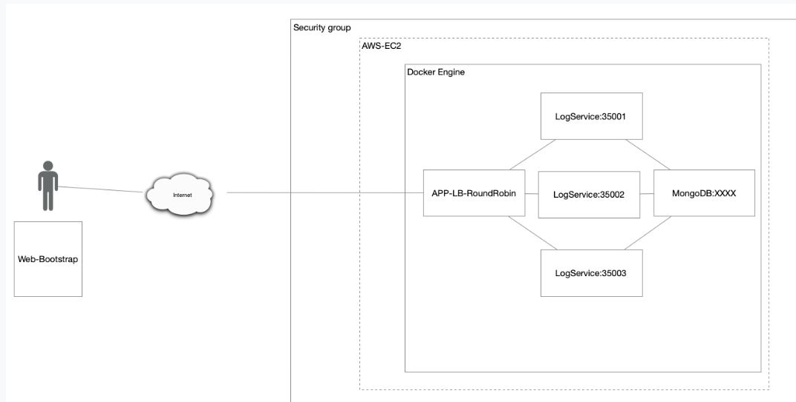
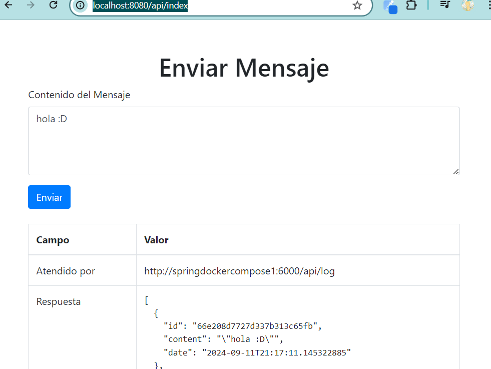
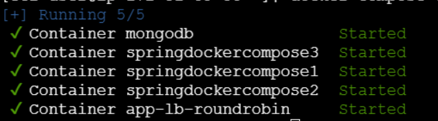
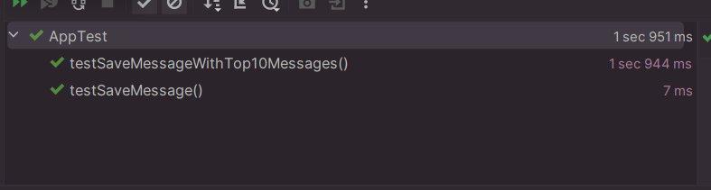

# TALLER DE DE MODULARIZACIÓN CON VIRTUALIZACIÓN E INTRODUCCIÓN A DOCKER


En esta aplicación, se implementa una solución distribuida y escalable utilizando servicios REST, bases de datos, y técnicas de balanceo de carga. El sistema está diseñado para ser desplegado en Amazon Web Services (AWS) utilizando instancias EC2 y Docker, proporcionando un entorno flexible y escalable para el manejo de datos y solicitudes web. La arquitectura está compuesta por los siguientes componentes:
## Arquitectura



1. El servicio MongoDB es una instancia de MongoDB corriendo en un container de docker en una máquina virtual de EC2
2. LogService es un servicio REST que recibe una cadena, la almacena en la base de datos y responde en un objeto JSON con las 10 últimas cadenas almacenadas en la base de datos y la fecha en que fueron almacenadas.
3. La aplicación web APP-LB-RoundRobin está compuesta por un cliente web y al menos un servicio REST. El cliente web tiene un campo y un botón y cada vez que el usuario envía un mensaje, este se lo envía al servicio REST y actualiza la pantalla con la información que este le regresa en formato JSON. El servicio REST recibe la cadena e implementa un algoritmo de balanceo de cargas de Round Robin, delegando el procesamiento del mensaje y el retorno de la respuesta a cada una de las tres instancias del servicio LogService.


## Empezando

### Requisitos Previos
Para ejecutar este proyecto, necesitarás tener instalado:

- Java JDK 17.
- Un IDE de Java como IntelliJ IDEA, Eclipse, o NetBeans.
- Maven para manejar las dependencias
- Un navegador web para interactuar con el servidor.
- Docker desktop 

### Instalación

1. Tener instalado Git en tu máquina local
2. Elegir una carpeta en donde guardes tu proyecto
3. abrir la terminal de GIT --> mediante el click derecho seleccionas Git bash here
4. Clona el repositorio en tu máquina local:
   ```bash
   git clone https://github.com/Medina95/Taller4_Arem_Virtualizaci-n.git
   ```
      ```bash
   git clone https://github.com/Medina95/RoundRobin.git
   ```
## Deployment
1. Abre los dos proyectos con tu IDE favorito o navega hasta el directorio del proyecto
2. Desde la terminal para compilar y empaquetar el proyecto ejecuta:

 ```bash
   mvn clean install
   ```
3. Crea las dos images desde tu terminal 
  - para la imagen que manejara los log services: 

   ```bash
    docker build -t springdockercompose .  
   ```
  - para la imagen del front y el servicio de round robin 
   ```bash
    docker build -t springdockercomposeround .
   ```
puedes cambiar los nombres pero deberas cambiar el docker compose 
4.  Ejecuta el docker.compose.yml 
   ```bash
    docker-compose up -d
   ```

7. Puedes interactuar con los endpoints RESFull (/api) con:
    - http://localhost:8080/api/index
    - 

   
## Despliegue en AWS  

- contenedores 

- imagenes


## Ejecutar las pruebas

El proyecto incluye pruebas unitarias que simulan el comportamiento del LogService:
1. Desde tu IDE, ejecuta la clase AppTest.java o desde la terminal ejecutas:
   ```bash
   mvn test
   ```
### Desglosar en pruebas de extremo a extremo
- **testSaveMessageWithTop10Messages**: Verifica  que se devuelvan los 10 mensajes más recientes.
- **testSaveMessage**: Verifica que se guarde un nuevo mensaje .

### Ejemplo
 ```bash
    public void testSaveMessage() {
        List<Message> mockMessages = new ArrayList<>();// Crea una lista vacía para simular que no hay mensajes almacenados en la db.

        // Simula el comportamiento del repositorio para devolver una lista vacía.
        when(messageRepository.findTop10ByOrderByDateDesc()).thenReturn(mockMessages);

        // Llama al método saveMessage con un nuevo mensaje de prueba.
        ResponseEntity<List<Message>> response = logController.saveMessage("Mensaje de prueba");

        // Verifica que el nuevo mensaje fue guardado en el repositorio.
        verify(messageRepository, times(1)).save(any(Message.class));

        // Verifica que el código de estado de la respuesta sea 200 (OK).
        assertEquals(200, response.getStatusCodeValue());

        // Verifica que la lista de mensajes en la respuesta sea la esperada.
        assertEquals(mockMessages, response.getBody());
    }
      
   ```


## Built With
* [Maven](https://maven.apache.org/) - Dependency Management
* [Docker](https://www.docker.com/) - Dependency Management


## Authors

* **Carolina Medina Acero** - [Medina95](https://github.com/Medina95)
